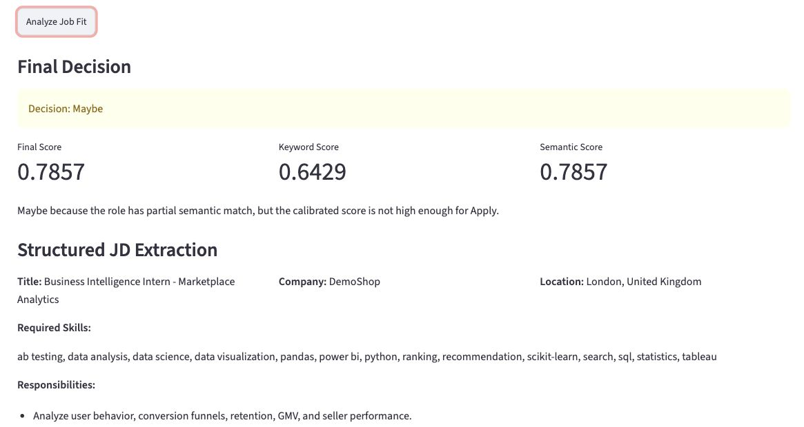
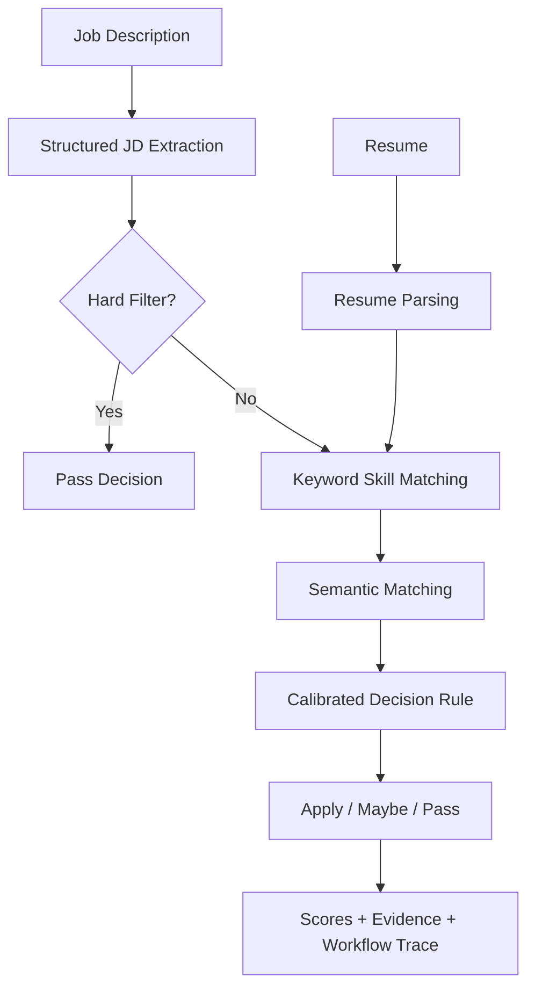

# Agentic Job Intelligence

> Public repository note: this repo uses anonymized sample data. Generated result files are excluded because they may contain resume-derived information.

## 项目亮点

Agentic Job Intelligence 是一个可解释的岗位匹配分析系统，用于比较一份 Job Description 和一份 Resume，并输出 `Apply` / `Maybe` / `Pass` 的申请建议。

这个项目最初来自真实求职场景：用于快速筛选英国实习岗位的 JD，判断岗位是否值得投入申请时间。它不是简单的 ChatGPT wrapper，而是把岗位判断拆成一个可追踪的 agentic decision pipeline，包括 structured JD parsing、resume parsing、hard filter detection、keyword matching、semantic matching、calibrated decision rule 和 Streamlit 可视化展示。

核心亮点：

- 使用 LangGraph 构建多节点 workflow，并对 hard-filter 岗位做 conditional routing。
- 使用 sentence-transformer embeddings 匹配 JD requirements 和 resume evidence，解决纯关键词匹配漏召回的问题。
- 加入 threshold calibration 和 error analysis，用于分析 semantic matching 的 over-matching 问题。
- 使用 Streamlit 构建交互式 Demo，展示匹配分数、matched/missing skills、semantic evidence 和 workflow trace。

## 系统流程

## 1. 项目简介

Agentic Job Intelligence 是一个面向求职场景的智能岗位分析系统。系统输入一份 Job Description 和一份 Resume，自动完成 JD 结构化抽取、简历解析、技能匹配、语义匹配、hard filter 检测、决策校准，并输出 Apply / Maybe / Pass 的岗位申请建议。

项目的核心目标不是简单调用大模型生成回答，而是构建一个可解释、可追踪、可评估的 agentic decision pipeline。系统通过工具函数、LangGraph workflow、semantic matching 和 threshold calibration，将非结构化 JD 和简历文本转化为结构化证据，并基于这些证据做出可解释决策。

## 2. 项目动机

在真实求职过程中，候选人往往需要快速判断大量岗位是否值得申请。人工筛选 JD 存在几个问题：

1. JD 文本格式不统一；
2. 岗位要求和简历经历之间不一定是完全相同的关键词；
3. 一些岗位存在硬性门槛，例如 PhD、多年工作经验；
4. 单纯关键词匹配容易漏掉语义相关经历；
5. 语义匹配如果不校准，又容易过度乐观；
6. 最终结果需要可解释，而不能只是一个黑箱分数。

因此，本项目构建了一个多阶段 Agentic Workflow，用于模拟一个求职分析助手：它不仅输出最终决策，还展示匹配证据、缺失技能、semantic evidence 和 workflow trace。

## 3. 系统功能

当前系统支持：

- JD parsing
- Resume parsing
- Skill matching
- Hard filter detection
- LangGraph workflow
- Conditional routing
- Semantic matching with sentence-transformer
- Structured JD extraction
- Threshold calibration
- Batch evaluation
- Streamlit interactive demo
- Result summary and error analysis

系统最终输出：

- Apply / Maybe / Pass
- keyword score
- semantic score
- matched skills
- missing skills
- semantic evidence
- hard filter reason
- structured JD fields
- workflow trace
- JSON / CSV evaluation results

## 4. 技术栈

项目主要使用：

- Python
- pandas
- scikit-learn
- sentence-transformers
- LangGraph
- Streamlit
- dataclasses
- JSON / CSV result logging

其中：

- `sentence-transformers` 用于将 JD skills 和 resume evidence 编码成 embeddings；
- cosine similarity 用于衡量语义匹配程度；
- LangGraph 用于构建 agent workflow 和 conditional routing；
- Streamlit 用于构建可交互 Demo；
- scikit-learn 用于 evaluation metrics 和 threshold calibration。

## 5. 项目结构

    agentic-job-intelligence/
    ├── app.py
    ├── README.md
    ├── requirements.txt
    ├── requirements-dev.txt
    ├── assets/
    │   └── demo.jpg
    ├── data/
    │   ├── job_descriptions/
    │   │   ├── sample_jd_1.txt
    │   │   ├── sample_jd_2_hard_filter.txt
    │   │   ├── sample_jd_3_apply.txt
    │   │   └── sample_jd_4_complex_format.txt
    │   ├── labels/
    │   │   └── job_labels.csv
    │   └── resumes/
    │       └── my_resume.txt
    ├── tests/
    │   └── test_core_pipeline.py
    └── src/
        ├── parse_jd.py
        ├── parse_resume.py
        ├── match_skills.py
        ├── decision_engine.py
        ├── semantic_matcher.py
        ├── semantic_decision_engine.py
        ├── structured_jd_extractor.py
        ├── tools.py
        ├── agent_workflow.py
        ├── agent_workflow_conditional.py
        ├── agent_workflow_semantic.py
        ├── agent_workflow_structured.py
        ├── batch_run.py
        ├── langgraph_batch_run.py
        ├── langgraph_semantic_batch_run.py
        ├── langgraph_structured_batch_run.py
        ├── summarize_results.py
        ├── summarize_langgraph_results.py
        ├── summarize_semantic_results.py
        ├── summarize_structured_results.py
        ├── evaluate_decisions.py
        ├── evaluate_langgraph_decisions.py
        ├── evaluate_semantic_decisions.py
        ├── evaluate_structured_decisions.py
        ├── calibrate_thresholds.py
        └── compare_calibration_before_after.py

说明：`results/` 是本地运行 batch/evaluation 后生成的结果目录。公开仓库默认不上传该目录，因为其中可能包含由 resume 文本派生出的字段；如需复现实验，可运行 batch/evaluation 脚本重新生成。

## 6. Methodology

### 6.1 Stage 1: Baseline Decision Pipeline

第一阶段构建了基础 keyword-based decision pipeline，包括：

- JD parser
- Resume parser
- skill matching
- required / preferred skill weighting
- score breakdown for explainable decisions
- hard filter detection
- Apply / Maybe / Pass decision engine
- batch run
- evaluation

基础决策规则为：

    if hard filter triggered -> Pass
    elif weighted_skill_match_score >= threshold -> Apply
    elif partial match -> Maybe
    else -> Pass

该阶段建立了一个可解释、可复现、可评估的 baseline。当前 baseline 会区分 required skills 和 preferred skills，并采用 0.8 / 0.2 的加权分数，避免 preferred skills 对最终决策产生过高影响。

加权分数会同时输出 `score_breakdown`，包括 required skill score、preferred skill score、权重、命中数量和缺失数量，方便分析每次决策的来源。

### 6.2 Stage 2: LangGraph Agent Workflow

第二阶段将普通 Python pipeline 升级为 LangGraph workflow。

系统被拆分为多个节点：

- parse_jd
- parse_resume
- make_decision
- hard_filter_pass
- save_result

并加入 conditional routing：

    parse_jd
        ├── hard filter triggered -> hard_filter_pass -> save_result
        └── otherwise -> parse_resume -> make_decision -> save_result

该阶段的核心价值是让系统具备 agent workflow 的结构，而不是单一脚本顺序执行。同时，系统保存 workflow trace，方便解释和 debugging。

### 6.3 Stage 3: Semantic Matching Enhancement

第三阶段加入 semantic matching，用于解决 keyword matching 过于严格的问题。

系统使用 `sentence-transformers` 将 JD missing skills 和 resume evidence 编码成 embeddings，并通过 cosine similarity 判断语义相似度。

例如，如果 JD 要求 `data science`，简历中没有完全相同关键词，但有 `data analysis internship` 或相关项目经历，semantic matching 可以捕捉这种语义相关性。

该阶段输出：

- keyword score
- semantic score
- keyword matched skills
- keyword missing skills
- final matched skills
- final missing skills
- required / preferred semantic score breakdown
- semantic evidence

Stage 3 的结果显示，semantic matching 可以提高匹配覆盖率，但也可能产生 over-matching。当前 semantic score 会进一步区分 required skills 和 preferred skills，并使用 0.8 / 0.2 权重生成最终 weighted semantic score。

### 6.4 Stage 4: Structured JD Extraction

第四阶段解决真实 JD 格式不统一的问题。

旧 parser 在复杂 JD 上容易出现：

    title = About the job
    company = None
    location = missing

因此项目新增 structured JD extractor，抽取：

- title
- company
- location
- required skills
- responsibilities
- education requirements
- hard constraints

在复杂 JD 上，structured extractor 成功抽取：

    title = Business Intelligence Intern - Marketplace Analytics
    company = DemoShop
    location = London, United Kingdom

随后，structured extractor 被封装为 tool，并接入 LangGraph workflow。

### 6.5 Stage 5: Threshold Calibration

第五阶段解决 semantic matching 的 over-matching 问题。

原始 semantic decision rule 为：

    score >= 0.75 -> Apply
    score >= 0.45 -> Maybe
    score < 0.45 -> Pass

该规则导致一个边界岗位被错误判断为 Apply：

    sample_jd_1.txt
    true_label = Maybe
    pred_label = Apply
    semantic_score = 0.80

因此项目新增 threshold calibration 脚本，系统比较不同 Apply threshold 和 Maybe threshold 下的 accuracy 和 macro-F1。

最终将 Apply threshold 从 0.75 调整为 0.85，并加入 required skill gate，避免 preferred skills 过度影响最终决策：

    required_semantic_score >= 0.95 -> Apply
    weighted_semantic_score >= 0.85 and required_semantic_score >= 0.90 -> Apply
    weighted_semantic_score >= 0.45 -> Maybe
    weighted_semantic_score < 0.45 -> Pass
    hard filter -> Pass

在扩展到 12 个匿名合成 JD 后，单纯使用 weighted semantic score 会暴露两个边界问题：

- required skills 全部匹配，但 preferred skill 缺失时，岗位可能被压成 Maybe；
- preferred skills 匹配较多时，可能掩盖 required skill 的缺口。

因此项目进一步加入 required skill gate。扩展后的 structured workflow evaluation 从：

    accuracy = 0.8333
    macro_f1 = 0.85

提升到：

    accuracy = 1.00
    macro_f1 = 1.00
    num_samples = 12

需要注意的是，当前 evaluation set 仍然是匿名合成 toy JD，因此该结果主要用于验证 evaluation、calibration 和 decision rule 逻辑，而不能代表真实泛化能力。

初始 4 个 JD 的 calibration 结果仍保留为项目演进记录；当前公开 evaluation set 已扩展到 12 个匿名合成 JD，用于覆盖更多 Apply / Maybe / Pass 场景。

### 6.6 Stage 6: Streamlit Demo

第六阶段使用 Streamlit 构建了可交互 Demo。

用户可以输入 JD 和 Resume，点击 Analyze Job Fit 后，系统展示：

- Final Decision
- Final Score
- Keyword Score
- Semantic Score
- Structured JD Extraction
- Resume Parsing
- Final Matched Skills
- Final Missing Skills
- Required / Preferred Score Breakdown
- Semantic Evidence
- Workflow Trace

该 Demo 将后端 pipeline 转化为可展示的 end-to-end application。

## 7. Evaluation Results

当前 toy evaluation set 包含 12 个匿名合成 JD：

    sample_jd_1.txt -> Maybe
    sample_jd_2_hard_filter.txt -> Pass
    sample_jd_3_apply.txt -> Apply
    sample_jd_4_complex_format.txt -> Apply
    sample_jd_5_ai_agent_apply.txt -> Apply
    sample_jd_6_recommendation_apply.txt -> Apply
    sample_jd_7_bi_maybe.txt -> Maybe
    sample_jd_8_cloud_data_engineer_pass.txt -> Pass
    sample_jd_9_research_scientist_pass.txt -> Pass
    sample_jd_10_nlp_maybe.txt -> Maybe
    sample_jd_11_ml_data_science_apply.txt -> Apply
    sample_jd_12_analytics_engineer_maybe.txt -> Maybe

### Initial 4-Sample Calibration Check

    accuracy = 0.75
    macro_f1 = 0.60

主要错误：

    sample_jd_1.txt was predicted as Apply instead of Maybe

### Current 12-Sample Structured Workflow Evaluation

    accuracy = 1.00
    macro_f1 = 1.00
    num_samples = 12

Confusion matrix:

                 pred_Apply  pred_Maybe  pred_Pass
    true_Apply            5           0          0
    true_Maybe            0           4          0
    true_Pass             0           0          3

该结果说明 threshold calibration 和 required skill gate 能够缓解 semantic over-matching，但当前样本量较小且标签为人工构造，不能过度解释。

## 8. Streamlit Demo

安装运行依赖：

    pip install -r requirements.txt

运行 Demo：

    streamlit run app.py

打开浏览器：

    http://localhost:8501

Demo 页面包括：

- JD 输入框
- Resume 输入框
- Analyze Job Fit 按钮
- Final Decision
- Scores
- Structured JD Extraction
- Skill Matching
- Required / Preferred Score Breakdown
- Preferred Matched / Missing Skills
- Semantic Evidence
- Workflow Trace

## 9. Tests

运行不依赖大模型的核心逻辑测试：

    pip install -r requirements.txt
    pip install -r requirements-dev.txt
    pytest

GitHub Actions 会在每次 push 和 pull request 时自动运行同一组测试。

当前测试覆盖：

- JD parser
- Resume parser
- hard filter detection
- skill matching
- required / preferred skill weighting
- decision score breakdown
- semantic decision required-skill gate
- baseline decision rule

## 10. Key Findings

本项目的主要发现包括：

1. Keyword matching 可解释性强，但容易漏掉语义相关经历；
2. Semantic matching 能提高匹配覆盖率，但可能导致 over-matching；
3. Hard filter 对 PhD、多年经验等硬性要求非常重要；
4. Structured JD extraction 能提升复杂 JD 的解析质量；
5. Threshold calibration 可以让 Apply / Maybe / Pass 决策更稳定；
6. Workflow trace 能提升 agent system 的可解释性；
7. Required / preferred score breakdown 能让 decision score 的来源更加透明；
8. Streamlit Demo 能让 pipeline 更适合展示和面试讲解。

## 11. Limitations

当前项目仍有以下局限：

1. Evaluation set 仍然较小，目前只有 12 个匿名合成 JD；
2. 标签是人工构造的，不能代表真实岗位分布；
3. 当前 structured extraction 是 rule-based，还没有接入真实 LLM JSON extraction；
4. 当前没有支持 PDF / DOCX 简历上传；
5. 当前 required / preferred 权重是人工设定，还没有通过更大验证集自动调优；
6. 当前 missing critical skills penalty 仍然是 rule-based，还没有学习得到；
7. 当前 threshold 可能对 toy set 过拟合；
8. 当前 Demo 还没有支持 batch JD analysis。

## 12. Future Work

后续可以继续改进：

1. 收集更多真实 JD，构建更大的 evaluation set；
2. 引入真实 LLM JSON extraction；
3. 使用 Pydantic schema 校验 LLM 输出；
4. 支持 Resume PDF / DOCX 上传；
5. 使用 validation set 调优 required / preferred skill weighting；
6. 使用更多验证数据调优 missing critical skills penalty；
7. 使用 validation / test split 做更可靠的 threshold calibration；
8. 在 Streamlit 中加入 threshold slider；
9. 支持 batch JD upload 和结果下载；
10. 将 Demo 部署到 Streamlit Community Cloud 或 Hugging Face Spaces。
